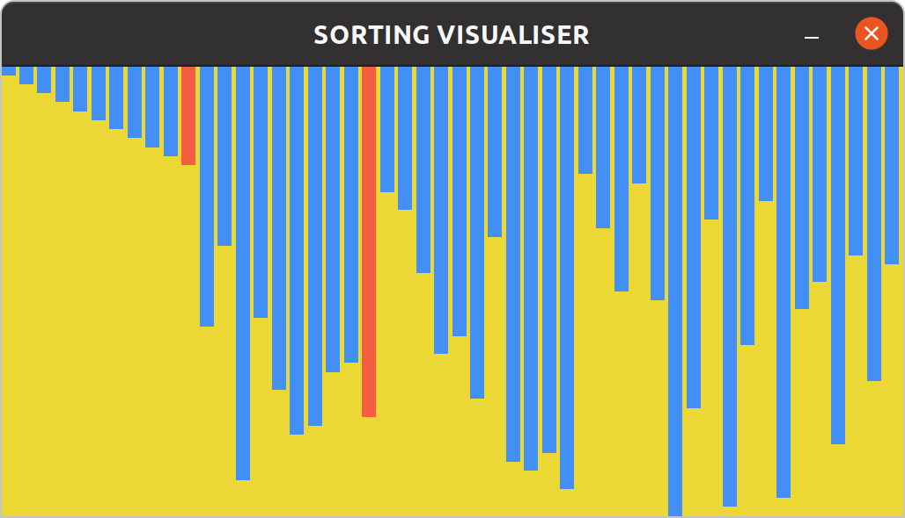

# Sorting Algorithms Visualisation


## Requirements

- pygame
- argparse
- numpy


## Run

```
python main.py -n [NUM_ELEMENTS] -a [ALGORITHM]
```
## Currently implemented

- [X] Selection Sort : selection_sort
- [x] Bubble Sort : bubble_sort
- [x] Insertion Sort : insertion_sort
- [x] Merge Sort : merge_sort
- [ ] Quick Sort : quick_sort
- [ ] Heap Sort : heap_sort
- [X] Counting Sort : counting_sort
- [ ] Radix Sort : radix_sort


